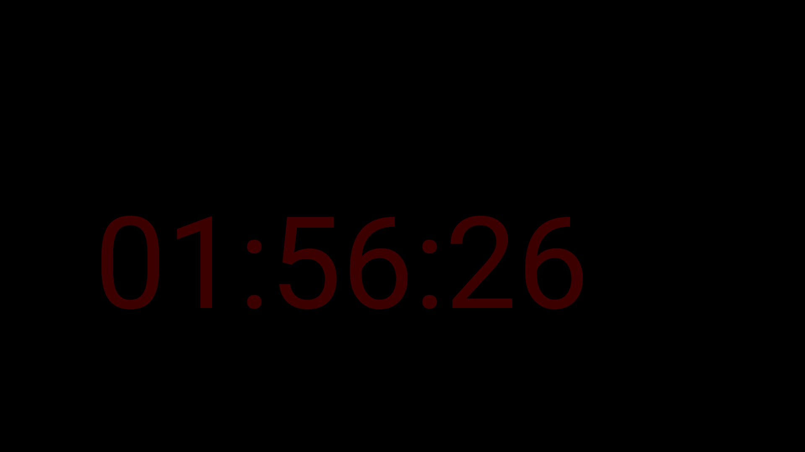
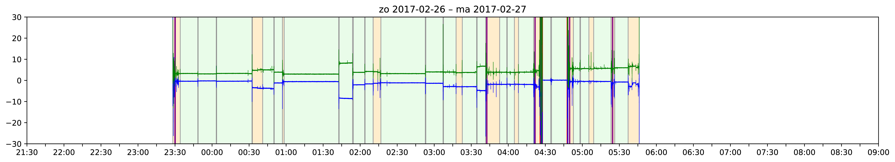

# zzz
This repository contains some software I wrote to help me (analyse my) sleep. I run SleepLogger on a phone below my pillow to track movement during the night. SleepTimer helps me applying Stimulus Control Therapy and SleepLoggerReader visualises the data.

## Projects in this repository
Each project is stored in a separate branch.

### SleepLogger
I use SleepLogger to get an impression of how much time I am asleep. I tried some sleep tracking apps from Google Play but I found that they did not provide enough detail. My SleepLogger app simply dumps the accelerometer data to a file. Next to accelerometer data, the app logs the screen state. This allows you to mark a moment in time by simply perssing the power button of your device.

### SleepTimer

Stimulus Control Therapy states that if you are unable to fall asleep within approx 20 minutes you should get out of bed. This app helps me track how much time has passed since the last time I thought I woke up (which is the moment I should have reset the stopwatch). This works much better for me than looking at the alarm clock since I constantly forget at which time I woke up during the night. This app stores the times at which the stopwatch was reset.

The SleepTimer app constantly shows a stopwatch in a dark red font on a dark background. I run this on a phone I attached to the underside of a shelf above my head. During the night I can glance at the time without any effort. 

### SleepLoggerReader
This project visualises the data from SleepLogger and SleepTimer. A Python script generates graphs per night. Multiple graphs are combined into a LaTeX document. 
Example:

The green and blue lines in the graph show the pitch and roll of the phone under the pillow. This graph shows a wake-up around 3:45. The vertical purple line indicates resets from the SleepTimer. Movement data shows that there is no sleep for the rest of the night. Around 4:30 I left the bed and indicated this by putting the phone itself in a vertical position.

## Usage
When you turn off the lights and enter your bed, start the SleepLogger app and put the phone below your pillow. In the morning you open the app to stop the data collection. To visualise the data you have to copy the files from `/sdcard/Android/data/hberntsen.sleeplogger/files` to the data directory of SleepLoggerReader. Then use the makefile to generate the graphs. To incorporate the data from SleepTimer, copy the logs from `/sdcard/Android/data/hberntsen.sleeptimer/files` but overwrite the timestamp in the filename with the time from SleepLogger. 
